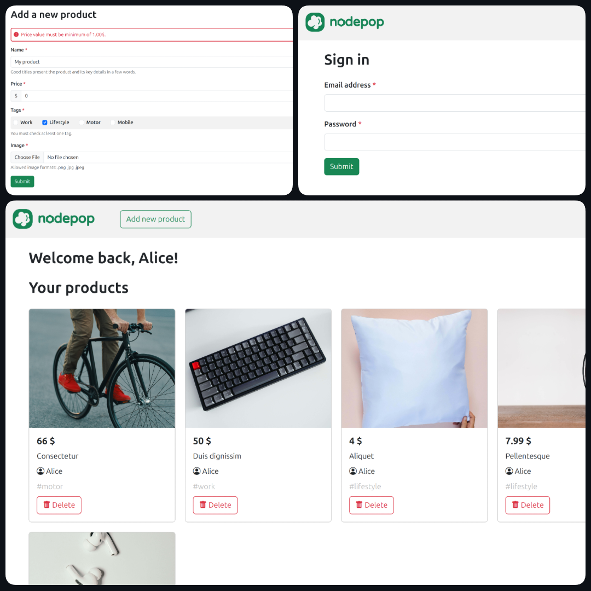

# Nodepop

Proyecto de práctica del módulo de Desarrollo Backend con Nodejs, Express y MongoDB, para #KeepCoding.

## 📌 Tabla de contenidos

- [Descripción](#descripción)
- [Instalación](#instalación)
- [Uso](#uso)
- [Tecnologías y Prácticas Utilizadas](#tecnologías-utilizadas)
- [Capturas](#capturas)
- [Autor](#autor)

## Descripción

Aplicación web con Server Side Rendering para servicios de venta de artículos de segunda mano. 

Los artículos se componen de nombre, precio, propietario, foto y etiquetas (work, lifestyle, motor y mobile). Permite la creación y borrado persistente de artículos.

## Instalación 

Para instalar el proyecto en tu máquina, sigue los siguientes pasos:

1. Clona el repositorio del proyecto:
    ```bash
    git clone https://github.com/miguelferlez/keepcoding-practica-backend.git
    ```

2. Navega hasta el directorio de la app del repositorio o ejecuta el terminal en dicha ruta:
    ```bash
    cd Path/to/keepcoding-practica-backend/nodepop
    ```

3. Instala las dependencias de la app:
    ```bash
    npm install
    ```

4. En el primer despliegue de la app, inicializa la base de datos:
    ```bash
    npm run initDB
    ```

## Uso

Una vez completada la instalación, para hacer uso la app de Nodepop se deben seguir los siguientes pasos:

1. Descarga y/o ejecuta [MongoDB](https://www.mongodb.com/try/download/community) en tu ordenador:
    - Windows: instalar ejecutable.
    - MacOS / Linux:
        ```bash
        cd Path/to/MongoDB
        mkdir data
        ./bin/mongod --dbpath ./data
        ```

2. Inicia la aplicación o el entorno de desarrollo:
    ```bash
    npm start
    npm run dev
    ```

3. En tu navegador, dirígete a [localhost:3000](http://localhost:3000) o al puerto que hayas establecido por defecto.

4. Haz login con las credenciales de los usuarios creados para testear la app, disponibles en `initDB.js`:
    - `admin@example.com`
    - `user@example.com`
    - `alice@example.com`
    - `bob@example.com`

    La contraseña de todos los usuarios de la base de datos para testing es `1234`.

## Tecnologías y Prácticas Utilizadas

- Bootstrap
- Express
    - ✅ EJS
    - ✅ Express-generator
    - ✅ Express-session, autenticación por sesión y cookies
    - ✅ Middlewares y async-await
    - ✅ Multer, subida de archivos en formularios
- MongoDB
    - ✅ Bcrypt, hash de contraseñas
    - ✅ Connect-mongo, almacenamiento de sesiones
    - ✅ Mongoose, conexión a base de datos, schemas, manipulación de registros
- Node
    - ✅ ES Modules
    - ✅ NPM
    - ✅ Servidores HTTP

## Capturas

</img>

## Autor

Miguel Fernández @miguelferlez